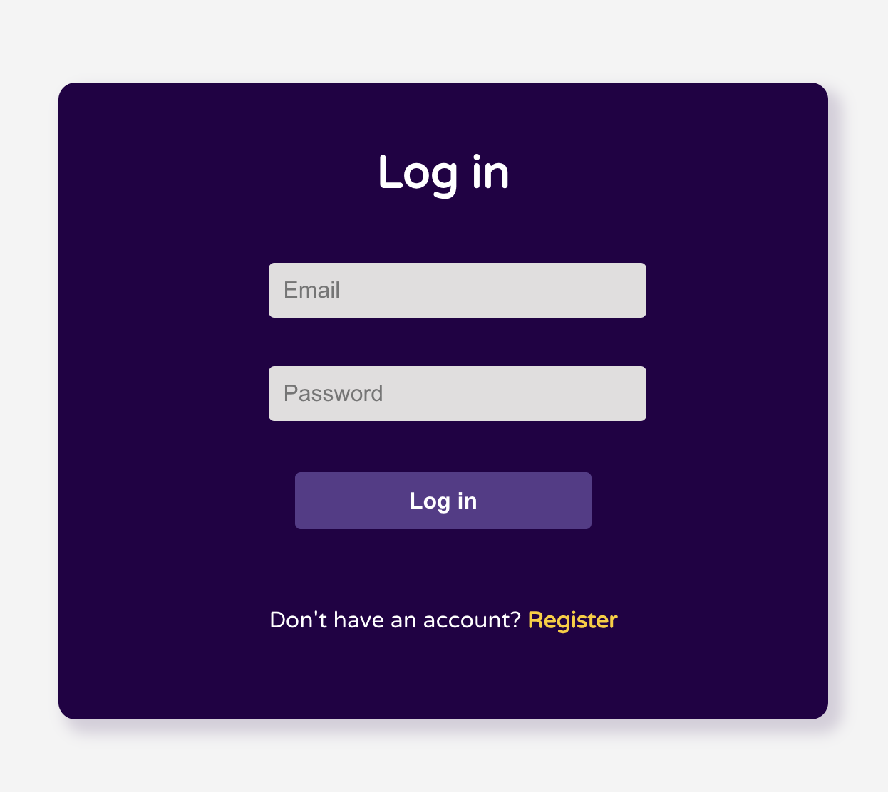
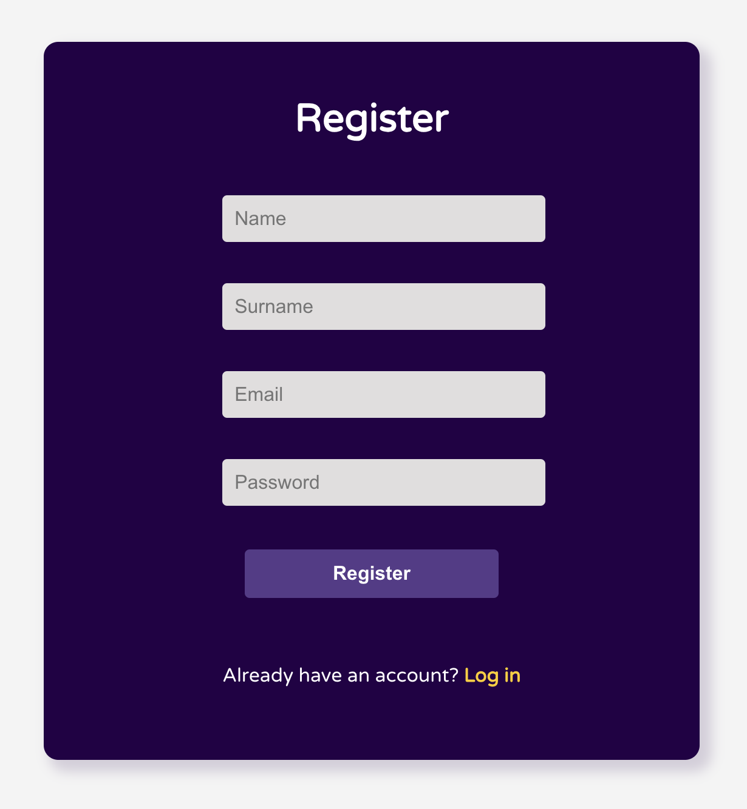
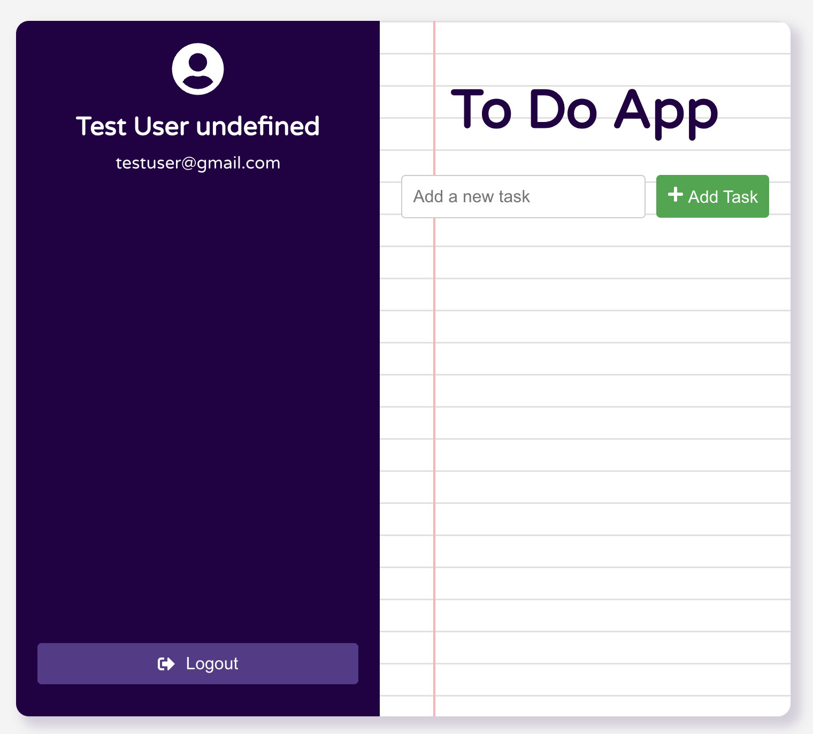

# To-Do List Application

This is a full-stack MERN (MongoDB, Express, React, Node.js) to-do list application with user authentication and authorization. Users can register, log in, and manage their tasks.

## Features
- User registration and login
- JWT-based authentication
- Create, read, update, and delete (CRUD) tasks
- Middleware to enforce specific rules
    - Respond with an HTTP 403 to all requests by users whose usernames don’t end with the substring ‘@gmail.com’
    - Reject the addition of tasks that exceed 140 characters
    - Reject any requests that are not of the JSON content type


## Prerequisites
- Node.js
- MongoDB Atlas account
- Thunder Client extension for Visual Studio Code


## Setup Instructions
1. Clone the Repository
```bash
git clone https://github.com/Mishismail/to-do-app-mern.git
cd to-do-app-mern
```

2. Install Dependencies
**Backend**
```bash
cd backend
npm install
```

**Frontend**
```bash
cd ../frontend
npm install
```

3. Create a MongoDB Atlas Database
  1. Go to MongoDB Atlas and sign in or create an account.
  2. Create a new cluster.
  3. In the cluster, create a new database called todoDB.
  4. Create a collection named users and another collection named tasks.
  5. In the Security tab, add a new database user with read and write permissions.
  6. Get the connection string for your cluster. It will look something like this:

   ```bash
   mongodb+srv://<username>:<password>@cluster0.mongodb.net/todoDB?retryWrites=true&w=majority
   ```

4. Configure Environment Variables
- Create a .env file in the backend directory and add the following:
```bash
MONGO_URI=mongodb+srv://<username>:<password>@cluster0.mongodb.net/todoDB?retryWrites=true&w=majority
JWT_SECRET=your_jwt_secret
```

5. Run the Application
**Backend**
```bash
cd backend
npm start
```
**Frontend**
```bash
cd ../frontend
npm start
```
 he application should now be running on http://localhost:3000.

## Testing with Thunder Client
1. Register User
- Endpoint: POST /api/users
- Headers: Content-Type: application/json
- Body:
```bash
{
  "name": "John",
  "surname": "Doe",
  "email": "johndoe@gmail.com",
  "password": "password123"
}
```

2. Login User
- Endpoint: POST /api/users/login
- Headers: Content-Type: application/json
- Body:
```bash
{
  "email": "johndoe@gmail.com",
  "password": "password123"
}
```

3. Get User Profile
- Endpoint: GET /api/users/profile
- Headers:
- Authorization: Bearer <token>

4. Add Task
- Endpoint: POST /api/tasks
- Headers:
- Content-Type: application/json
- Authorization: Bearer <token>
- Body:
```bash
{
  "text": "New task"
}
```

5. Get Tasks
- Endpoint: GET /api/tasks
- Headers:
- Authorization: Bearer <token>


6. Update Task
- Endpoint: PUT /api/tasks/<task_id>
- Headers:
- Content-Type: application/json
- Authorization: Bearer <token>
- Body:
```bash
{
  "text": "Updated task"
}
```

7. Delete Task
-Endpoint: DELETE /api/tasks/<task_id>
- Headers:
- Authorization: Bearer <token>


8. Testing Middleware
**Non-JSON Content Type**
- Endpoint: POST /api/tasks
- Headers:
- Content-Type: image/jpeg
- Authorization: Bearer <token>
- Body: Any image file

**Task Exceeding 140 Characters**
- Endpoint: POST /api/tasks
- Headers:
- Content-Type: application/json
- Authorization: Bearer <token>
- Body:
```bash
{
  "text": "This task exceeds 140 characters. Lorem ipsum dolor sit amet, consectetur adipiscing elit. Integer nec odio. Praesent libero. Sed cursus ante dapibus diam."
}
```

**Email Not Ending with @gmail.com**
- Endpoint: POST /api/users
- Headers: Content-Type: application/json
- Body:
```bash
{
  "name": "Jane",
  "surname": "Smith",
  "email": "janesmith@yahoo.com",
  "password": "password123"
}
```

## Troubleshooting
- Ensure MongoDB Atlas connection string is correct and replace <username> and <password> with your actual database username and password.
- Ensure JWT_SECRET is set in the .env file.
- Make sure to restart the server after making changes to environment variables.

## License
This project is licensed under the MIT License.

## Login



## Register



## To Do


